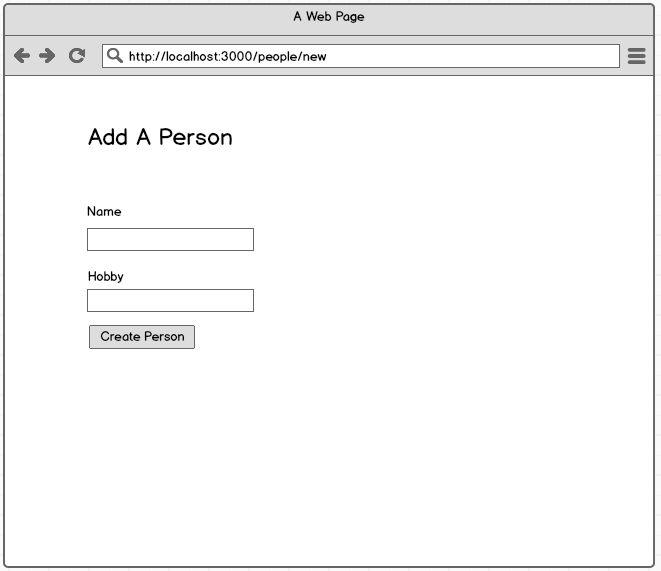

# Form Validations in Express

## Setup

1. Scaffold out a new project boilerplate - `yo galvanize-express`.
1. Install the dependencies - `npm install`

## Stories

### Users can create puppies

```sh
When a user goes to the site's homepage
And clicks "Add a Puppy"
And fills out the form
And clicks "Create Puppy"
Then they should see the created puppy on the puppies index page
And a success message should appear
```


> DO NOT use the browser's HTML5 form validation. Make sure this is validated on the server-side!

### Users can create people

```sh
When a user goes to the site's homepage
And clicks "Add a Person"
And fills out the form
And clicks "Create Person"
Then they should see the created person on the people index page
And a success message should appear
```




### Errors are displayed when a form is not filled out correctly

```sh
When a user fills out a form
And clicks "Submit"
When any of the form fields are blank (or invalid)
Then the 'new' template should be re-rendered and error messages should appear
```


